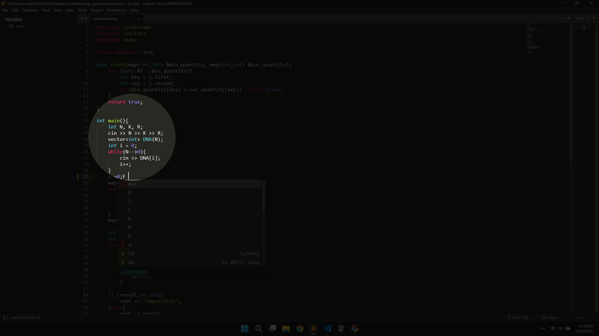

Idea: 
Take the screenshot of the screen first ->
    Create a Pygame screen (Transparent & Border less) -> 
        With-in the application -> 
            Now add Spotlight Focus to the screen.

TODO: Add zoom(similar to magnifier). 


# Installation:
Clone the Repository.
```py
pip install keyboard
pip install pygame
pip install pyinstaller 
pyinstaller --noconsole main.py # Converts py file to executable
python3 keyboard_listener.py
```

+ You can add the `keyboard_listener.py` to your Action trigger if you are on windows.

Example:

